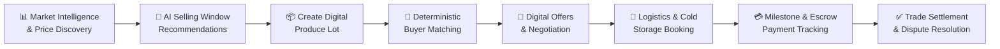
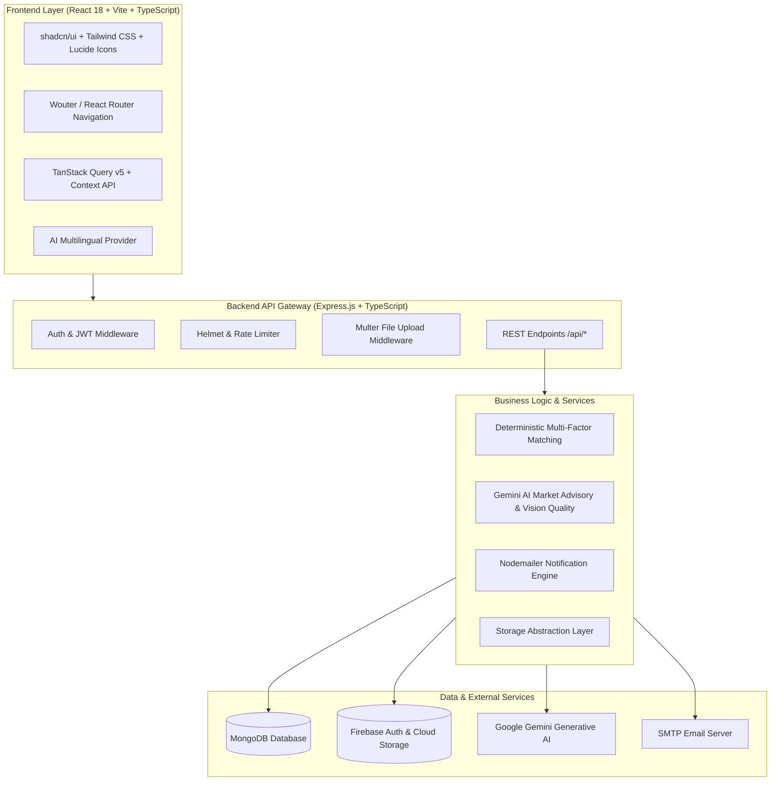

# 🌾 AgriLink — AI-Powered Farmer Market Intelligence & Direct Buyer Platform

<div align="center">


**AgriLink is an advanced digital agricultural platform that empowers farmers and Farmer Producer Organizations (FPOs) with real-time APMC market intelligence, AI-driven selling window recommendations, deterministic direct buyer matching, and transparent end-to-end digital trade execution.**

</div>

---

## 📌 Table of Contents

- [Overview](#-overview)
- [End-to-End Trade Lifecycle](#-end-to-end-trade-lifecycle)
- [Core Features & Modules](#-core-features--modules)
- [System Architecture](#-system-architecture)
- [Technology Stack](#-technology-stack)
- [Directory Structure](#-directory-structure)
- [Installation & Setup](#-installation--setup)
- [Environment Variables Configuration](#-environment-variables-configuration)
- [API Reference](#-api-reference)
- [Multi-Role Workflows](#-multi-role-workflows)
- [Contributing](#-contributing)
- [License](#-license)

---

## 📖 Overview

Smallholder farmers and agricultural aggregators frequently face market opacity, extreme price volatility at local APMC mandis, high middleman margins, and lack of verified institutional buyers. 

**AgriLink** solves these systemic challenges by creating an integrated, transparent ecosystem:
- **Aggregates real-time APMC mandi prices**, arrival volumes, and historical price movements across agricultural commodities.
- **Calculates net farm-gate realizations** by deducting dynamic logistics and freight costs from regional mandi prices.
- **Provides AI-powered selling advisories** with price momentum analysis and confidence scores to optimize harvest timing.
- **Connects sellers directly with verified institutional buyers** (food processors, supermarket chains, exporters, and bulk traders).
- **Employs explainable deterministic matching algorithms** to pair produce lots with buyer purchase orders.
- **Streamlines digital offers, negotiations, and legally structured digital trade contracts**.
- **Coordinates freight hauling and cold-chain/warehouse storage reservations**.
- **Tracks payment escrow milestones and verified bank settlements** (UTR receipts).
- **Supports FPO aggregation** for pooling smallholder produce into high-value commercial bulk lots.
- **Enables QR-code-based farm-to-fork traceability** and supply chain ownership tracking.

---

## 🔄 End-to-End Trade Lifecycle



1. **Market Intelligence & Price Discovery**: View real-time APMC mandi modal prices, arrival volumes, and freight-deducted net realization across nearby markets.
2. **AI Selling Window Recommendation**: Evaluate 7-day and 30-day price momentum, wholesale demand, and risk factors to decide whether to sell immediately or hold.
3. **Digital Produce Lot Creation**: Specify crop variety, quantity (quintals), quality grade, harvest date, location, target price, and AI-assisted quality assessment.
4. **Deterministic Buyer Matching**: Pair produce lots with active B2B purchase orders using multi-factor scoring (crop fit, volume, quality specs, proximity, net realization).
5. **Digital Offers & Negotiation**: Receive instant offers from verified buyers, negotiate counter-prices, and execute agreed transactions.
6. **Logistics & Storage Coordination**: Calculate freight transport fares, book verified logistics haulers, or reserve nearby cold storage.
7. **Escrow & Payment Tracking**: Follow full lifecycle statuses (Lot Created → Offer Accepted → Transaction Confirmed → Logistics Arranged → In Transit → Delivered → Payment Received → Completed) with UTR verification.
8. **Dispute Arbitration**: Transparent grievance filing and administrative mediation for payment, quality, delivery, or logistics discrepancies.

---

## ✨ Core Features & Modules

### 1. 📊 Localized Market Intelligence
- Real-time data aggregation across major agricultural commodities (Wheat, Rice, Cotton, Soybean, Tomato, Potato, Onion, Maize, Mustard, Chana, Turmeric, Ginger, etc.).
- Modal, minimum, and maximum price tracking per quintal across regional APMC mandis.
- Distance-based freight deductions calculating net farm-gate profit margins.
- 5-day and 30-day historical price and arrival volume charts powered by Recharts.

### 2. 🤖 AI Selling Window Recommendations
- Predictive market advisories powered by Google Gemini AI and market momentum models.
- Actionable selling advice (e.g., *"Hold for 3–5 days"*, *"Sell immediately"*, *"Stagger harvest"*).
- Key drivers breakdown (e.g., declining arrivals, festive retail demand, warehouse availability) with risk factors and confidence ratings (High / Medium / Moderate).

### 3. 🏢 Direct Verified Buyer Procurement
- Open procurement portal for verified B2B buyers (Processors, Retailers, Institutional Aggregators, Exporters, and Traders).
- Buyer credentials verification with GSTIN and FSSAI documentation badges.
- Transparent purchase requirements: minimum grade, batch size, target price, delivery terms, and payment criteria.

### 4. 📦 Digital Produce Lots & AI Quality Assessment
- Standardized digital lot registration for farmers and FPOs.
- Detailed visual grading parameters: moisture percentage, size category, color uniformity, and defect tolerance.
- AI-assisted image analysis evaluating produce quality score (1–10) and defect detection.

### 5. 🎯 Deterministic Multi-Factor Matching Engine
- Transparent, explainable match algorithm (0–100% score) evaluated across 5 weighted dimensions:
  - **Crop & Variety Compatibility** (30%)
  - **Volume & Quantity Alignment** (20%)
  - **Quality Grade Compliance** (20%)
  - **Geographic Proximity & Freight Feasibility** (15%)
  - **Net Realization & Target Price Viability** (15%)
- Provides human-readable match rationale and automated top recommendations.

### 6. 💬 Digital Offers & Contract Negotiation
- Formal digital purchase bids issued directly to produce lots.
- Counter-offer mechanisms allowing sellers and buyers to adjust pricing and delivery terms in real-time.
- One-click offer acceptance converting deals into active digital trade contracts.

### 7. 🚚 Integrated Logistics & Cold Storage Directory
- Agricultural transport freight calculator with vehicle capacity estimation (Mini Trucks, 5-Ton Eicher, 10-Ton Trucks, Reefer/Cold Trucks).
- Directory of verified transport operators with per-km rates, base fares, and pickup turnaround times.
- Searchable directory of nearby storage facilities (Warehouses, Cold Storage, Collection Centers) with live capacity and monthly storage rates.

### 8. 💳 Milestone Payment & Escrow Settlement Tracking
- 9-stage transaction pipeline from initial agreement to final settlement.
- Proof of payment upload (PNG, JPEG, WebP, PDF) with direct storage support.
- Bank transfer reference (UTR) tracking ensuring transparent payment validation before lot release.

### 9. 👥 FPO Produce Aggregation Hub
- Dedicated interface for Farmer Producer Organizations (FPOs).
- Member farmer roster management with land size, primary crops, and historical contributions.
- Produce pooling module to assemble smallholder harvests into commercial bulk lots commanding institutional premiums.

### 10. ⚖️ Dispute & Grievance Arbitration
- Structured grievance filing covering Payment, Quality, Quantity, Delivery, and Logistics issues.
- Evidence attachment upload (inspection reports, weighbridge slips, damage photographs).
- Multi-party resolution workflow with administrator mediation and audit logs.

### 11. 🔍 QR Code Authenticity & Supply Chain Traceability
- Dynamic QR code generation for every produce lot and product batch.
- Mobile-optimized QR scanner for instant batch verification in field or mandi.
- Immutable ownership transfer history and chain-of-custody tracking from farm to retail.

### 12. 🌐 Multilingual Accessibility
- AI-driven regional language translation powered by Google Gemini AI.
- Instant switching between English, Hindi, Telugu, Tamil, Kannada, Marathi, Punjabi, Gujarati, and Bengali.

---

## 🏗 System Architecture



---

## 🛠 Technology Stack

### Frontend
| Component | Technology | Version | Description |
|---|---|---|---|
| **Framework** | React | `^18.3.1` | Modern declarative component architecture |
| **Language** | TypeScript | `^5.6.3` | Strong typing across client models and interfaces |
| **Bundler & Dev Server** | Vite | `^6.1.0` | Ultra-fast HMR and optimized production bundling |
| **Styling** | Tailwind CSS | `^3.4.17` | Utility-first CSS styling system |
| **Component Library** | shadcn/ui + Radix UI | Latest | Accessible, headless UI primitives |
| **Data Fetching** | TanStack Query | `^5.60.5` | Asynchronous state management and caching |
| **Routing** | Wouter / React Router | `^7.9.1` | Lightweight, robust client-side routing |
| **Form Handling** | React Hook Form + Zod | `^7.55.0` | Performant form state and schema validation |
| **Charts & Visuals** | Recharts | `^2.15.2` | Interactive market price and arrival charts |
| **Animations** | Framer Motion | `^11.13.1` | Fluid UI transitions and micro-interactions |
| **QR Code Engine** | qrcode.react / @zxing | `^4.2.0` | Dynamic QR generation and camera-based scanning |

### Backend & Storage
| Component | Technology | Version | Description |
|---|---|---|---|
| **Server Framework** | Express.js | `^4.21.2` | RESTful API server with TypeScript support |
| **Runtime** | Node.js | `>=18.0.0` | JavaScript/TypeScript asynchronous runtime |
| **Database** | MongoDB | `^6.19.0` | Document database for lots, demands, trades, users |
| **Authentication** | Firebase Auth / JWT | `^12.2.1` | Multi-provider authentication and session management |
| **Cloud Storage** | Firebase Storage / Local | `^12.2.1` | Payment proof receipts and lot image attachments |
| **AI Engine** | Google Gemini Generative AI | `^0.24.1` | Market insights, translations, and quality analysis |
| **Email Service** | Nodemailer | `^8.0.10` | Transactional email alerts and updates |
| **Security** | Helmet, CORS, Rate Limit | Latest | API protection, secure headers, and abuse prevention |

---

## 📁 Directory Structure

```
AgriLink/
├── client/                               # React Frontend Application
│   ├── public/                           # Static assets, icons, and manifests
│   └── src/
│       ├── components/                   # Reusable UI components
│       │   ├── ui/                       # shadcn/ui base primitives (Button, Dialog, Card, etc.)
│       │   ├── Footer.tsx                # Global footer component
│       │   ├── LandingNavbar.tsx         # Responsive landing page navigation
│       │   ├── NavigationHeader.tsx      # Main application authenticated navigation
│       │   ├── PaymentProofModal.tsx     # Payment documentation upload modal
│       │   ├── ProductRegistrationForm.tsx # Produce lot registration form
│       │   ├── QRCodeGenerator.tsx       # Dynamic QR code renderer
│       │   ├── QRCodeScanner.tsx         # Camera-based QR code reader
│       │   ├── RoleDashboard.tsx         # Role-specific dashboard views
│       │   ├── SupplyChainMap.tsx        # Supply chain node visualization
│       │   └── UserSearch.tsx            # Directory search and filter component
│       ├── hooks/                        # Custom React hooks (useAuth, useLanguage, useToast)
│       ├── lib/                          # Client utilities, Firebase client, QueryClient
│       ├── pages/                        # Application views & route handlers
│       │   ├── LandingPage.tsx           # Public platform landing page
│       │   ├── HowItWorks.tsx            # Interactive workflow explanation
│       │   ├── about.tsx                 # About the platform and mission
│       │   ├── contact.tsx               # Inquiries and support form
│       │   ├── dashboard.tsx             # Primary operational dashboard
│       │   ├── market-intelligence.tsx   # Live APMC mandis, price trends, AI selling windows
│       │   ├── buyer-demand.tsx          # B2B buyer procurement demand catalog
│       │   ├── verified-buyers.tsx       # Verified institutional buyer directory
│       │   ├── create-lot.tsx            # Digital produce lot creation & grading
│       │   ├── offers-matches.tsx        # Deterministic match scores & offer negotiation
│       │   ├── transactions.tsx          # 9-stage trade contract execution & escrow tracking
│       │   ├── logistics-storage.tsx     # Freight calculator & storage reservation
│       │   ├── payments.tsx              # Payment reconciliation & UTR verification
│       │   ├── disputes.tsx              # Grievance filing & dispute arbitration
│       │   ├── fpo-aggregation.tsx       # FPO smallholder member aggregation hub
│       │   ├── admin.tsx                 # Platform administration & verification portal
│       │   ├── profile.tsx               # User profile, role settings, and preferences
│       │   ├── login.tsx                 # Authentication (Email/Password & OAuth)
│       │   ├── product-details.tsx       # Detailed produce lot view & provenance
│       │   └── not-found.tsx             # 404 error page
│       ├── App.tsx                       # Root component with routing and providers
│       ├── index.css                     # Design tokens, variables, and global CSS
│       └── main.tsx                      # Application client entry point
│
├── server/                               # Express.js Backend Server
│   ├── data/                             # Mock/initial market prices and historical trends
│   │   └── marketData.ts
│   ├── ai.ts                             # Google Gemini AI translation and quality grading
│   ├── aiMatching.ts                     # Deterministic multi-factor match scoring engine
│   ├── auth.ts                           # Password hashing, JWT signing, and auth middleware
│   ├── email.ts                          # Nodemailer email notification service
│   ├── firebaseJwt.ts                    # Firebase ID token verification
│   ├── firebaseStorage.ts                # Firebase Cloud Storage upload handler
│   ├── index.ts                          # Server startup, middleware configuration, port binding
│   ├── routes.ts                         # Complete REST API route controllers
│   ├── storage.ts                        # MongoDB database implementation & interface
│   └── vite.ts                           # Vite development server middleware
│
├── shared/                               # Shared Types & Schemas
│   └── schema.ts                         # TypeScript interfaces & Zod validation schemas
│
├── uploads/                              # Local storage fallback for payment proofs & media
├── .env.example                          # Environment variable template
├── .gitignore                            # Git ignore configuration
├── package.json                          # Dependencies, scripts, and package metadata
├── tsconfig.json                         # TypeScript compiler configuration
├── vite.config.ts                        # Vite build configuration
└── tailwind.config.ts                    # Tailwind CSS theme and typography configuration
```

---

## ⚙️ Installation & Setup

### Prerequisites
- **Node.js**: v18.0.0 or higher
- **npm** (v9+) or **yarn** / **pnpm**
- **MongoDB**: Local MongoDB instance or MongoDB Atlas connection URI
- **Google Gemini API Key**: For AI recommendations and quality analysis ([Google AI Studio](https://aistudio.google.com/))
- **Firebase Project** (Optional for OAuth / Cloud Storage): ([Firebase Console](https://console.firebase.google.com/))

### 1. Clone the Repository
```bash
git clone https://github.com/Manikantasai1724/AgriLink.git
cd AgriLink
```

### 2. Install Dependencies
```bash
npm install
```

### 3. Configure Environment Variables
Create a `.env` file in the root directory by copying `.env.example`:
```bash
cp .env.example .env
```

Edit `.env` and supply your connection strings and API keys (see [Environment Variables Configuration](#-environment-variables-configuration) below).

### 4. Start Development Server
```bash
npm run dev
```

The application will start on **`http://localhost:5001`** with hot module replacement (HMR) enabled for the frontend and automatic reload for the backend.

### 5. Build for Production
```bash
npm run build
npm start
```

---

## 🔐 Environment Variables Configuration

| Variable | Required | Description | Default / Example |
|---|:---:|---|---|
| `PORT` | No | Port on which the Express server listens | `5001` |
| `NODE_ENV` | No | Runtime environment (`development` or `production`) | `development` |
| `MONGODB_URI` | **Yes** | MongoDB connection string (Atlas or Local) | `mongodb://localhost:27017/agrilink` |
| `MONGO_DB_NAME` | No | Target MongoDB database name | `agrilink` |
| `GOOGLE_GEMINI_API_KEY` | No | API Key for Gemini AI recommendations & translation | `AIzaSy...` |
| `JWT_SECRET` | No | Secret key used for signing session tokens | `your-secret-key-min-32-chars` |
| `VITE_FIREBASE_API_KEY` | No | Firebase Web API Key for client SDK | `AIzaSy...` |
| `VITE_FIREBASE_AUTH_DOMAIN` | No | Firebase Auth domain for login redirects | `your-app.firebaseapp.com` |
| `VITE_FIREBASE_PROJECT_ID` | No | Firebase Project ID | `your-project-id` |
| `VITE_FIREBASE_STORAGE_BUCKET` | No | Firebase Cloud Storage bucket for proofs/images | `your-app.appspot.com` |
| `VITE_FIREBASE_MESSAGING_SENDER_ID` | No | Firebase Cloud Messaging sender identifier | `1234567890` |
| `VITE_FIREBASE_APP_ID` | No | Firebase Web App Unique Identifier | `1:123456:web:abcd` |
| `EMAIL_SERVICE` | No | SMTP Email provider service | `gmail` |
| `EMAIL_USER` | No | SMTP sender email address | `alerts@example.com` |
| `EMAIL_PASS` | No | SMTP application password | `xxxx-xxxx-xxxx-xxxx` |

> ⚠️ **Security Notice**: Never commit `.env` or production credentials to source control.

---

## 📡 API Reference

### 1. Market Intelligence & Advisories
| Method | Endpoint | Description |
|---|---|---|
| `GET` | `/api/market-prices` | Fetch live APMC mandi prices with freight-adjusted net realization |
| `GET` | `/api/market-trends/:crop` | Get 7-day/30-day historical prices, arrival trends, and AI selling window advice |

### 2. Buyer Demand & Procurement
| Method | Endpoint | Description |
|---|---|---|
| `GET` | `/api/buyer-demands` | List active B2B purchase orders from verified buyers |
| `POST` | `/api/buyer-demands` | Create a new buyer procurement demand requirement |

### 3. Produce Lots & AI Matching
| Method | Endpoint | Description |
|---|---|---|
| `GET` | `/api/produce-lots` | List registered produce lots (filterable by seller, crop, status) |
| `POST` | `/api/produce-lots` | Register a new digital produce lot with quality parameters |
| `GET` | `/api/produce-lots/:id` | Get comprehensive details of a specific produce lot |
| `GET` | `/api/produce-lots/:id/matches` | Execute deterministic multi-factor matching for a produce lot |

### 4. Offers & Contracts
| Method | Endpoint | Description |
|---|---|---|
| `GET` | `/api/agri-offers` | Get digital purchase offers (filterable by lotId or sellerId) |
| `POST` | `/api/agri-offers` | Submit a formal purchase offer or counter-offer for a lot |
| `PATCH` | `/api/agri-offers/:id/status` | Accept, reject, or counter an offer (converts to transaction on accept) |

### 5. Transactions & Escrow Settlement
| Method | Endpoint | Description |
|---|---|---|
| `GET` | `/api/agri-transactions` | List user transactions across all lifecycle stages |
| `GET` | `/api/agri-transactions/:id` | Retrieve detailed transaction contract and milestone timestamps |
| `PATCH` | `/api/agri-transactions/:id/status` | Advance transaction lifecycle stage (Logistics Arranged, In Transit, etc.) |
| `PATCH` | `/api/agri-transactions/:id/payment` | Submit payment verification details and UTR bank reference |

### 6. Logistics & Storage
| Method | Endpoint | Description |
|---|---|---|
| `GET` | `/api/logistics-options` | List verified agricultural freight transporters and rate cards |
| `GET` | `/api/storage-facilities` | List nearby cold storage and warehouse facilities with available capacity |

### 7. Disputes & Grievances
| Method | Endpoint | Description |
|---|---|---|
| `GET` | `/api/disputes` | List all open and resolved dispute cases |
| `POST` | `/api/disputes` | File a new trade dispute with evidence documentation |
| `PATCH` | `/api/disputes/:id/resolve` | Administrative resolution and settlement determination |

### 8. FPO Aggregation Hub
| Method | Endpoint | Description |
|---|---|---|
| `GET` | `/api/fpo-members` | Retrieve roster of affiliated smallholder farmers |
| `POST` | `/api/fpo-members` | Register a new member farmer under the FPO |

### 9. AI Services & Tools
| Method | Endpoint | Description |
|---|---|---|
| `POST` | `/api/ai/analyze-quality` | Analyze crop produce image and generate AI quality grading score |
| `POST` | `/api/ai/translate` | Translate agricultural content into regional Indian languages |

---

## 👥 Multi-Role Workflows

AgriLink supports role-specific interfaces tailored for each stakeholder:

```
┌─────────────────┐     ┌─────────────────┐     ┌─────────────────┐
│   🌱 Farmer     │     │    👥 FPO       │     │   🏢 Buyer      │
│  - Mandi Prices │     │  - Pool Produce │     │  - Post Demands │
│  - AI Advice    │     │  - Bulk Lots    │     │  - Make Offers  │
│  - Create Lots  │     │  - Member Roster│     │  - Track Orders │
└────────┬────────┘     └────────┬────────┘     └────────┬────────┘
         │                       │                       │
         └───────────────────────┼───────────────────────┘
                                 ▼
                     ┌───────────────────────┐
                     │ 🌾 AgriLink Platform  │
                     │  - Multi-Factor Match │
                     │  - Trade Contracts    │
                     │  - Freight & Storage  │
                     │  - Escrow Tracking    │
                     │  - Dispute Resolution │
                     └───────────────────────┘
```

- **Farmers**: Inspect localized mandi rates, receive AI harvest advisories, list lots, accept verified buyer offers, and monitor payments.
- **FPOs (Farmer Producer Organizations)**: Aggregate produce from multiple smallholders to build commercial bulk batches, negotiate high-value contracts, and track member revenue splits.
- **Buyers & Processors**: Post recurring commodity demands with quality criteria, browse matched produce lots, send digital bids, and track shipment milestones.
- **Logistics & Storage Providers**: List freight vehicles, provide transport quotes, and manage cold storage bookings.
- **Platform Administrators**: Verify buyer credentials (GSTIN/FSSAI), arbitrate disputes, monitor market price data feeds, and oversee platform integrity.

---

## 🤝 Contributing

We welcome contributions from developers, agritech researchers, and open-source enthusiasts.

### Contribution Process
1. **Fork the Repository** on GitHub.
2. **Clone your fork**:
   ```bash
   git clone https://github.com/YOUR_USERNAME/AgriLink.git
   cd AgriLink
   ```
3. **Create a feature branch**:
   ```bash
   git checkout -b feature/your-feature-name
   ```
4. **Implement changes** following TypeScript and React best practices.
5. **Verify code quality**:
   ```bash
   npm run check
   ```
6. **Commit changes** using descriptive messages:
   ```bash
   git commit -m "[feat] Implement dynamic freight rate calculator"
   ```
7. **Push to your fork** and submit a **Pull Request** explaining your enhancements.

---

## 📄 License

This project is licensed under the **MIT License** — see the [LICENSE](LICENSE) file for details.

---

<div align="center">

### 🌾 Empowering Farmers • Connecting Markets • Transforming Agriculture

[⬆ Back to Top](#-agrilink--ai-powered-farmer-market-intelligence--direct-buyer-platform)

</div>
