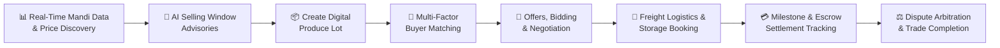
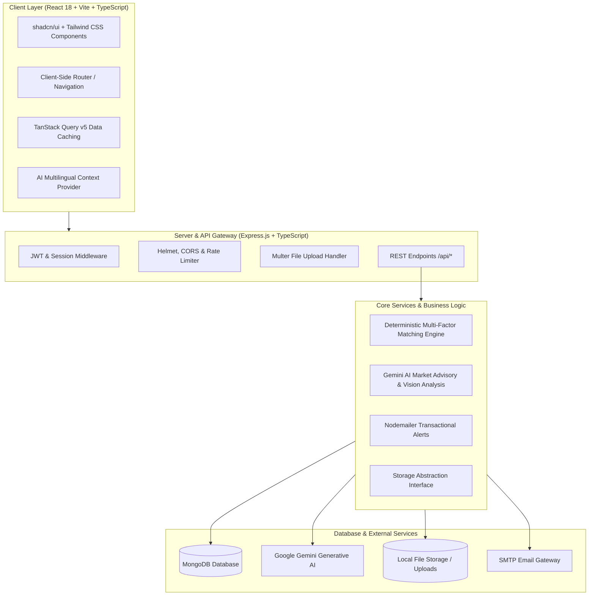

# 🌾 AgriLink — AI-Powered Farmer Market Intelligence & Direct Buyer Platform

<div align="center">


**AgriLink is a smart agricultural marketplace and intelligence platform that connects farmers and Farmer Producer Organizations (FPOs) directly with verified institutional buyers, providing real-time APMC mandi analytics, AI-assisted selling window recommendations, and end-to-end digital trade execution.**

</div>

---

## 📌 Table of Contents

- [Platform Overview](#-platform-overview)
- [Core Workflows](#-core-workflows)
- [Key Features & Modules](#-key-features--modules)
- [System Architecture](#-system-architecture)
- [Tech Stack](#-tech-stack)
- [Project Structure](#-project-structure)
- [Environment Configuration (.env)](#-environment-configuration-env)
- [Installation & Local Setup](#-installation--local-setup)
- [REST API Reference](#-rest-api-reference)
- [Role-Based Access](#-role-based-access)

---

## 📖 Platform Overview

Agricultural markets often face high price volatility, middleman-dominated supply chains, lack of direct institutional access, and information asymmetry for smallholder producers. 

**AgriLink** delivers a complete digital ecosystem that empowers farmers and FPOs to optimize price discovery and trade execution:

- **Live Mandi Intelligence**: Aggregates modal, minimum, and maximum prices alongside arrival volumes across major APMC markets.
- **Dynamic Net Realization**: Automatically deducts calculated logistics and freight costs from regional prices to show true net earnings per quintal.
- **AI-Powered Market Advisories**: Analyzes 7-day and 30-day price momentum with Google Gemini AI to provide actionable harvest and selling window advisories.
- **Direct Verified B2B Buyer Access**: Enables direct transactions with food processors, supermarket chains, and bulk commodity aggregators with verified credentials.
- **Deterministic Multi-Factor Matching**: Pairs registered produce lots with active buyer purchase orders using weighted, explainable criteria.
- **Digital Negotiation & Contracts**: Provides instant bidding, counter-offering, and legally structured digital trade contracts.
- **Logistics & Storage Coordination**: Built-in freight calculator, verified hauler directory, and cold-chain/warehouse booking.
- **Escrow & Settlement Tracking**: Multi-stage trade status tracker with bank transfer references (UTR) and payment proof verification.
- **FPO Aggregation Hub**: Aggregates produce from smallholders into commercial bulk lots for higher institutional price realization.
- **QR Code Traceability**: Instant batch provenance and chain-of-custody verification.

---

## 🔄 Core Workflows



1. **Market Intelligence**: Farmers browse live market rates across nearby mandis and view net realization after estimated freight deductions.
2. **AI Advice**: Predictive models analyze arrival volumes, seasonal trends, and wholesale demand to advise whether to sell immediately or hold.
3. **Lot Registration**: Sellers list produce lots with parameters (crop variety, quantity, harvest date, location, moisture, size, and AI visual quality grade).
4. **Buyer Matching**: The matching engine evaluates active buyer purchase orders against the lot, scoring compatibility across 5 weighted dimensions.
5. **Negotiation**: Buyers submit formal bids; sellers can accept or propose counter-offers in real time.
6. **Logistics & Storage**: Coordinate transport vehicles or reserve space in nearby temperature-controlled warehouses.
7. **Settlement**: Track payment milestones and upload transaction proofs (UTR / receipt) before releasing produce.
8. **Dispute Resolution**: Open structured claims for payment, quality, delivery, or quantity discrepancies with mediator review.

---

## ✨ Key Features & Modules

### 1. 📊 Localized Market Intelligence
- Real-time commodity tracking (Wheat, Rice, Cotton, Soybean, Tomato, Potato, Onion, Maize, Mustard, Chana, Turmeric, Ginger, etc.).
- Regional APMC mandi price cards with modal, minimum, and maximum rates per quintal.
- Net realization calculation: `Net Realization = Mandi Modal Price - Estimated Transport Cost`.
- Interactive 5-day and 30-day historical price and arrival charts built with Recharts.

### 2. 🤖 AI Selling Window Advisories
- Automated predictive advisories powered by Google Gemini AI.
- Actionable recommendations (e.g., *"Hold for 3–5 days"*, *"Immediate Sell"*, *"Stagger Selling"*).
- Key drivers breakdown (declining arrivals, wholesale demand surge, storage risk) with confidence ratings (High / Medium / Moderate).

### 3. 🏢 Direct B2B Procurement
- Open procurement portal for verified institutional buyers (Food Processors, Retailers, Exporters, and Wholesale Aggregators).
- Verification badge system based on business registration (GSTIN / FSSAI).
- Detailed procurement specifications: minimum quality grade, volume requirements, target price, and delivery terms.

### 4. 📦 Digital Produce Lots & Quality Grading
- Standardized digital produce lots registered with batch identifiers.
- Parameterized grading: moisture content, size grading, color uniformity, and defect tolerance.
- AI-assisted image analysis for visual quality grading and defect assessment.

### 5. 🎯 Deterministic Multi-Factor Matching Algorithm
- Transparent match score calculation (0–100%) evaluated across five weighted factors:
  - **Crop & Variety Compatibility** (30%)
  - **Volume & Quantity Alignment** (20%)
  - **Quality Grade Compliance** (20%)
  - **Geographic Proximity & Transport Feasibility** (15%)
  - **Net Realization & Target Price Viability** (15%)
- Provides clear explanation strings for every match score to maintain complete transparency.

### 6. 💬 Digital Offers & Contract Negotiation
- Formal digital purchase offers submitted directly to produce lots.
- Real-time counter-offering capability for flexible pricing negotiations.
- Instant conversion of accepted offers into digital trade contracts.

### 7. 🚚 Freight Logistics & Cold Storage Directory
- Agricultural transport freight calculator with vehicle capacity estimation (Mini Trucks, 5-Ton Eicher, 10-Ton Multi-Axle, Reefer Trucks).
- Verified transporter directory with per-km rates, base fares, and pickup lead times.
- Nearby warehouse and cold-chain facility directory with available capacity and storage rate cards.

### 8. 💳 Milestone Payment & Escrow Tracking
- 9-stage transaction lifecycle tracking:
  `Lot Created` ➔ `Offer Accepted` ➔ `Transaction Confirmed` ➔ `Logistics Arranged` ➔ `In Transit` ➔ `Delivered` ➔ `Payment Pending` ➔ `Payment Received` ➔ `Completed`
- Proof of payment upload (PNG, JPEG, WebP, PDF) with local/cloud storage.
- Bank UTR reference verification ensuring payment confirmation before lot handover.

### 9. 👥 FPO Aggregation Hub
- Dedicated portal for Farmer Producer Organizations (FPOs).
- Member roster management recording individual landholding and crop types.
- Smallholder produce pooling to assemble commercial bulk lots commanding institutional premiums.

### 10. ⚖️ Dispute & Grievance Arbitration
- Structured dispute logging for Payment, Quality, Quantity, Delivery, and Logistics issues.
- Attachment of photographic and document evidence.
- Administrator mediation workflows with timestamped resolution notes.

### 11. 🔍 QR Code Traceability & Authentication
- Dynamic QR code generation for every produce lot.
- Integrated camera-based QR scanner for rapid field and warehouse verification.
- Farm-to-fork supply chain history and custody logs.

### 12. 🌐 Multilingual Accessibility
- AI translation engine powered by Google Gemini AI.
- Seamless interface switching across English, Hindi, Telugu, Tamil, Kannada, Marathi, Punjabi, Gujarati, and Bengali.

---

## 🏗 System Architecture



---

## 🛠 Tech Stack

| Domain | Technology | Version | Purpose |
|---|---|---|---|
| **Frontend Framework** | React | `^18.3.1` | Modern component-driven user interface |
| **Language** | TypeScript | `^5.6.3` | Type-safe code across frontend and backend |
| **Bundler & Tooling** | Vite | `^6.1.0` | High-performance HMR and production builds |
| **Styling** | Tailwind CSS | `^3.4.17` | Utility-first responsive styling |
| **UI Components** | shadcn/ui + Radix UI | Latest | Accessible, headless UI primitives |
| **State & Fetching** | TanStack Query | `^5.60.5` | Server state management and intelligent caching |
| **Charts** | Recharts | `^2.15.2` | Interactive mandi market price & arrival trends |
| **Animations** | Framer Motion | `^11.13.1` | Smooth UI transitions and micro-interactions |
| **QR Scanning** | qrcode.react / @zxing | `^4.2.0` | Dynamic QR code generation & camera scanner |
| **Backend Framework** | Express.js | `^4.21.2` | RESTful API server with TypeScript runtime |
| **Runtime** | Node.js | `>=18.0.0` | JavaScript/TypeScript asynchronous engine |
| **Database** | MongoDB | `^6.19.0` | Document database for lots, demands, and trades |
| **AI Integration** | Google Gemini Generative AI | `^0.24.1` | Market advisories, quality scoring, translation |
| **Security** | Helmet, CORS, Rate Limit | Latest | API protection, secure headers, and rate limiting |
| **Email Gateway** | Nodemailer | `^8.0.10` | Automated email notifications for trade events |

---

## 📁 Project Structure

```
AgriLink/
├── client/                               # Frontend Application
│   ├── public/                           # Static assets and icons
│   └── src/
│       ├── components/                   # UI components
│       │   ├── ui/                       # shadcn/ui base primitives (Button, Card, Dialog, etc.)
│       │   ├── Footer.tsx                # Platform footer
│       │   ├── LandingNavbar.tsx         # Responsive landing navigation bar
│       │   ├── NavigationHeader.tsx      # Authenticated navigation header
│       │   ├── PaymentProofModal.tsx     # Payment receipt upload modal
│       │   ├── ProductRegistrationForm.tsx # Lot registration form
│       │   ├── QRCodeGenerator.tsx       # Dynamic QR code renderer
│       │   ├── QRCodeScanner.tsx         # In-browser QR code scanner
│       │   ├── RoleDashboard.tsx         # Dynamic dashboard based on active role
│       │   └── SupplyChainMap.tsx        # Supply chain node visualization
│       ├── hooks/                        # Custom React hooks (useAuth, useLanguage, useToast)
│       ├── lib/                          # Client utilities, query client, and helpers
│       ├── pages/                        # Page views and routes
│       │   ├── LandingPage.tsx           # Main public landing page
│       │   ├── HowItWorks.tsx            # Interactive platform workflow guide
│       │   ├── about.tsx                 # About the platform
│       │   ├── contact.tsx               # Contact & inquiries
│       │   ├── dashboard.tsx             # Primary operational dashboard
│       │   ├── market-intelligence.tsx   # Live APMC mandis, price trends, AI selling windows
│       │   ├── buyer-demand.tsx          # B2B buyer procurement demands
│       │   ├── verified-buyers.tsx       # Verified buyer directory
│       │   ├── create-lot.tsx            # Digital produce lot creation & grading
│       │   ├── offers-matches.tsx        # Deterministic match scores & offer negotiation
│       │   ├── transactions.tsx          # 9-stage trade contract execution & escrow tracking
│       │   ├── logistics-storage.tsx     # Freight calculator & storage reservation
│       │   ├── payments.tsx              # Payment reconciliation & UTR verification
│       │   ├── disputes.tsx              # Grievance filing & dispute arbitration
│       │   ├── fpo-aggregation.tsx       # FPO smallholder member aggregation hub
│       │   ├── admin.tsx                 # Platform administration & verification portal
│       │   ├── profile.tsx               # User profile and role settings
│       │   ├── login.tsx                 # Authentication (Email/Password & OAuth)
│       │   ├── product-details.tsx       # Lot details and traceability
│       │   └── not-found.tsx             # 404 page
│       ├── App.tsx                       # Root routing and context providers
│       ├── index.css                     # Global styles, variables, and design tokens
│       └── main.tsx                      # Client entry point
│
├── server/                               # Express.js Backend Server
│   ├── data/
│   │   └── marketData.ts                 # Market price datasets and historical trends
│   ├── ai.ts                             # Google Gemini AI translation and vision quality grading
│   ├── aiMatching.ts                     # Deterministic multi-factor match scoring engine
│   ├── auth.ts                           # Authentication, JWT signing, password hashing
│   ├── email.ts                          # Nodemailer email notification service
│   ├── index.ts                          # Server startup, middleware, and route mounting
│   ├── routes.ts                         # REST API route controllers
│   ├── storage.ts                        # MongoDB database implementation & interface
│   └── vite.ts                           # Vite development server integration
│
├── shared/                               # Shared Definitions
│   └── schema.ts                         # TypeScript interfaces & Zod validation schemas
│
├── uploads/                              # Local storage for payment receipts & media
├── .env.example                          # Environment configuration template
├── package.json                          # Package scripts and dependencies
├── tsconfig.json                         # TypeScript configuration
├── vite.config.ts                        # Vite configuration
└── tailwind.config.ts                    # Tailwind CSS theme configuration
```

---

## 🔐 Environment Configuration (.env)

The application uses environment variables for database connectivity, authentication, and external services.

Create a `.env` file in the root directory by copying `.env.example`:

```bash
cp .env.example .env
```

### Environment Variables Reference

```env
# ─────────────────────────────────────────────
# 1. Authentication (Local JWT Secret)
# ─────────────────────────────────────────────
JWT_SECRET=your_super_secret_jwt_key_min_32_characters

# ─────────────────────────────────────────────
# 2. MongoDB Database Connection (REQUIRED)
# ─────────────────────────────────────────────
# Supports MongoDB Atlas or local MongoDB:
MONGODB_URI=mongodb+srv://<username>:<password>@cluster0.xxxxx.mongodb.net/?retryWrites=true&w=majority
MONGO_DB_NAME=agrilink

# ─────────────────────────────────────────────
# 3. Server Port
# ─────────────────────────────────────────────
PORT=5001

# ─────────────────────────────────────────────
# 4. Google Gemini API (OPTIONAL - for AI market insights & grading)
# ─────────────────────────────────────────────
# Obtain key at: https://aistudio.google.com/
GOOGLE_GEMINI_API_KEY=your_gemini_api_key

# ─────────────────────────────────────────────
# 5. Email Alerts (OPTIONAL - for trade notifications)
# ─────────────────────────────────────────────
EMAIL_SERVICE=gmail
EMAIL_USER=your-email@gmail.com
EMAIL_PASS=your-16-character-gmail-app-password
SMTP_FROM=alerts@agrilink.internal

# ─────────────────────────────────────────────
# 6. Firebase (OPTIONAL - for cloud storage fallback only)
# ─────────────────────────────────────────────
# Local /uploads/ storage is used by default.
# VITE_FIREBASE_API_KEY=your_api_key
# VITE_FIREBASE_AUTH_DOMAIN=your_project.firebaseapp.com
# VITE_FIREBASE_PROJECT_ID=your_project_id
# VITE_FIREBASE_STORAGE_BUCKET=your_project.appspot.com
# VITE_FIREBASE_MESSAGING_SENDER_ID=your_sender_id
# VITE_FIREBASE_APP_ID=your_app_id
```

| Variable | Required | Description | Default / Fallback |
|---|:---:|---|---|
| `MONGODB_URI` | **Yes** | MongoDB connection string (Atlas cluster or local) | None (Required for database) |
| `MONGO_DB_NAME` | No | Target MongoDB database name | `agrilink` |
| `JWT_SECRET` | No | Secret key for signing and verifying JWT tokens | Secure internal fallback |
| `PORT` | No | Port on which Express server listens | `5001` |
| `GOOGLE_GEMINI_API_KEY` | No | Google Gemini API key for AI advisories & quality grading | AI features fallback to deterministic defaults |
| `EMAIL_SERVICE` | No | SMTP email service provider (e.g., `gmail`) | Inactive if unset |
| `EMAIL_USER` / `EMAIL_PASS` | No | SMTP credentials for transactional trade emails | Inactive if unset |
| `SMTP_FROM` | No | Outgoing sender email header | `no-reply@agrilink.internal` |

---

## ⚙️ Installation & Local Setup

### Prerequisites
- **Node.js**: v18.0.0 or higher
- **npm**: v9+ (or **yarn** / **pnpm**)
- **MongoDB**: Local MongoDB server or free MongoDB Atlas cluster

### Step 1: Install Dependencies
```bash
npm install
```

### Step 2: Configure Environment
```bash
cp .env.example .env
```
Open `.env` and configure your `MONGODB_URI` and optional `GOOGLE_GEMINI_API_KEY`.

### Step 3: Run in Development Mode
```bash
npm run dev
```

Open **`http://localhost:5001`** in your browser. The frontend and backend run concurrently with live reloading.

### Step 4: Build for Production
```bash
npm run build
npm start
```

---

## 📡 REST API Reference

### Market Intelligence & Advisories
| Method | Endpoint | Description |
|---|---|---|
| `GET` | `/api/market-prices` | Retrieve live APMC mandi prices with freight-adjusted net realization |
| `GET` | `/api/market-trends/:crop` | Get 7-day/30-day historical prices, arrival trends, and AI selling window advice |

### Buyer Demands & Procurement
| Method | Endpoint | Description |
|---|---|---|
| `GET` | `/api/buyer-demands` | List active procurement requirements posted by verified buyers |
| `POST` | `/api/buyer-demands` | Create a new buyer demand requirement |

### Produce Lots & Matching Engine
| Method | Endpoint | Description |
|---|---|---|
| `GET` | `/api/produce-lots` | List registered produce lots (filterable by seller, crop, status) |
| `POST` | `/api/produce-lots` | Register a new digital produce lot with quality parameters |
| `GET` | `/api/produce-lots/:id` | Get comprehensive details of a produce lot |
| `GET` | `/api/produce-lots/:id/matches` | Execute deterministic multi-factor matching for a lot |

### Digital Offers & Negotiation
| Method | Endpoint | Description |
|---|---|---|
| `GET` | `/api/agri-offers` | Get digital purchase offers (filterable by lotId or sellerId) |
| `POST` | `/api/agri-offers` | Submit a purchase bid or counter-offer |
| `PATCH` | `/api/agri-offers/:id/status` | Accept, reject, or counter an offer (converts to transaction on acceptance) |

### Transactions & Settlement
| Method | Endpoint | Description |
|---|---|---|
| `GET` | `/api/agri-transactions` | List user transactions across all lifecycle stages |
| `GET` | `/api/agri-transactions/:id` | Retrieve detailed transaction contract and milestone timestamps |
| `PATCH` | `/api/agri-transactions/:id/status` | Advance trade lifecycle status |
| `PATCH` | `/api/agri-transactions/:id/payment` | Submit payment verification details and UTR reference |

### Logistics & Storage
| Method | Endpoint | Description |
|---|---|---|
| `GET` | `/api/logistics-options` | List verified transport operators and per-km rate cards |
| `GET` | `/api/storage-facilities` | List nearby cold storage and warehouse facilities with available capacity |

### Disputes & Grievances
| Method | Endpoint | Description |
|---|---|---|
| `GET` | `/api/disputes` | List all dispute cases |
| `POST` | `/api/disputes` | File a new trade dispute with evidence documentation |
| `PATCH` | `/api/disputes/:id/resolve` | Administrative resolution and settlement determination |

### FPO Aggregation
| Method | Endpoint | Description |
|---|---|---|
| `GET` | `/api/fpo-members` | Retrieve roster of affiliated smallholder farmers |
| `POST` | `/api/fpo-members` | Register a new member farmer under the FPO |

### AI Services
| Method | Endpoint | Description |
|---|---|---|
| `POST` | `/api/ai/analyze-quality` | Run AI vision quality grading on crop image |
| `POST` | `/api/ai/translate` | Translate agricultural content into regional languages |

---

## 👥 Role-Based Access

AgriLink provides dedicated dashboard views tailored to each user type:

- **🌱 Farmer**: View mandi prices, check AI harvest advisories, register produce lots, receive buyer offers, and track bank settlements.
- **👥 FPO (Farmer Producer Organization)**: Manage member farmers, pool harvests into bulk lots, negotiate commercial contracts, and distribute realization shares.
- **🏢 Buyer / Food Processor**: Post recurring commodity demands, review matched produce lots, place bids, and track incoming shipments.
- **🚚 Logistics / Storage Provider**: Offer transport services, manage vehicle availability, and handle warehouse storage reservations.
- **🛡️ Platform Administrator**: Verify buyer credentials (GSTIN / FSSAI), arbitrate disputes, monitor mandi price streams, and oversee system metrics.

---

<div align="center">

### 🌾 AgriLink — Empowering Farmers • Connecting Markets • Transforming Agriculture

[⬆ Back to Top](#-agrilink--ai-powered-farmer-market-intelligence--direct-buyer-platform)

</div>
